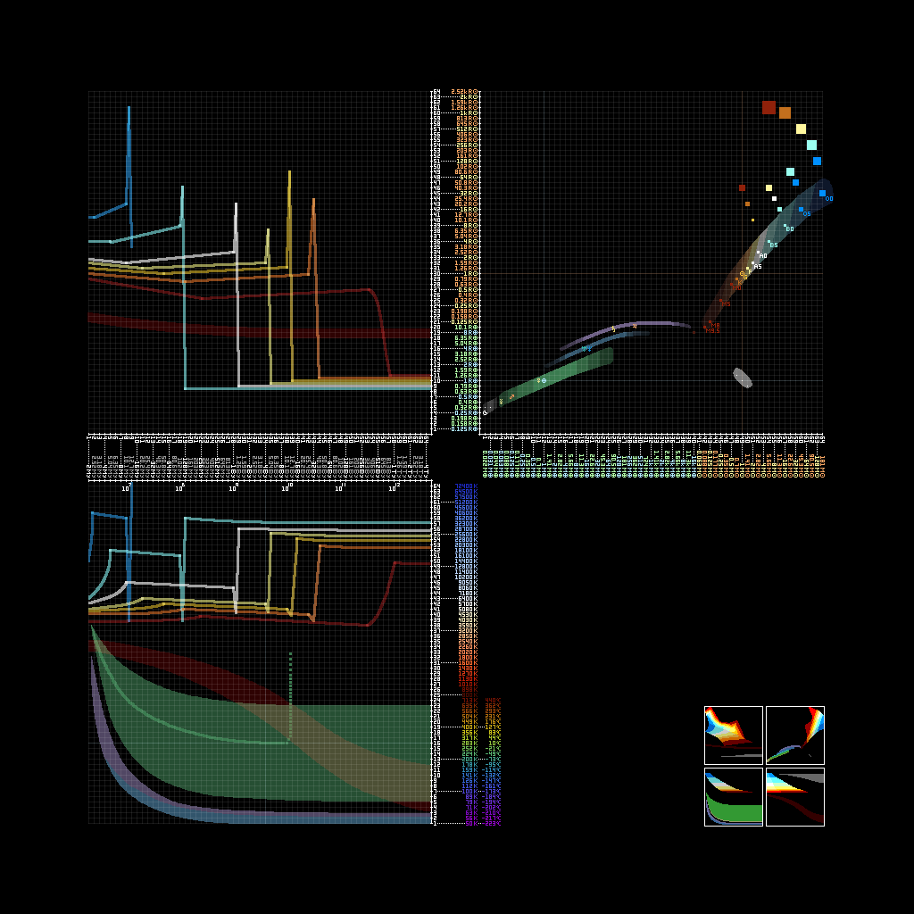

---
navigation:
  title: "§5Celestial Types"
  icon: "anvilcraft:overheated_ember_metal_block"
---

# Determining the Correct Parameter Combination

1. The left, top, right, and bottom axes represent the four parameters of the celestial body
2. The parameter groups form 3 focal points at the top-left, top-right, and bottom
3. If the three focal points are exactly the same color, the parameters are valid and the celestial body can be bound
4. Each color corresponds to a type of celestial body, as shown in the table below

|              Color               |                Type                | Stellar |
|:--------------------------------:|:----------------------------------:|:-------:|
| <color=#999966>999966</color> |          Large Satellite           |   No    |
| <color=#669933>669933</color> |  Rocky Planet (No Liquid)  |   No    |
| <color=#339933>339933</color> | Rocky Planet (Little Liquid) |   No    |
| <color=#339999>339999</color> | Rocky Planet (Medium Liquid) |   No    |
| <color=#33cccc>33cccc</color> |  Rocky Planet (Much Liquid) |   No    |
| <color=#336699>336699</color> |            Ice Giant              |   No    |
| <color=#666699>666699</color> |            Gas Giant              |   No    |
| <color=#330000>330000</color> |           Brown Dwarf             |   No    |
| <color=#660000>660000</color> |      M-type Main Sequence         |   Yes   |
| <color=#cc6600>cc6600</color> |      K-type Main Sequence         |   Yes   |
| <color=#cc9933>cc9933</color> |      G-type Main Sequence         |   Yes   |
| <color=#cccc66>cccc66</color> |      F-type Main Sequence         |   Yes   |
| <color=#cccccc>cccccc</color> |      A-type Main Sequence         |   Yes   |
| <color=#66cccc>66cccc</color> |      B-type Main Sequence         |   Yes   |
| <color=#0066cc>0066cc</color> |      O-type Main Sequence         |   Yes   |
| <color=#990000>990000</color> |       M-type Red Giant            |   Yes   |
| <color=#ff6600>ff6600</color> | K-type Red Giant (Orange Giant)   |   Yes   |
| <color=#ffcc00>ffcc00</color> | G-type Red Giant (Yellow Giant)   |   Yes   |
| <color=#ffff66>ffff66</color> | F-type Red Giant (Yellow Giant)   |   Yes   |
| <color=#ccffcc>ccffcc</color> | A-type Blue Giant (White Giant)   |   Yes   |
| <color=#66ffff>66ffff</color> |         B-type Blue Giant         |   Yes   |
| <color=#0099ff>0099ff</color> |         O-type Blue Giant         |   Yes   |
| <color=#ff0000>ff0000</color> |      M-type Red Supergiant        |   Yes   |
| <color=#ff9900>ff9900</color> | K-type Red Supergiant (Orange Supergiant) |   Yes   |
| <color=#ffcc66>ffcc66</color> | G-type Red Supergiant (Yellow Supergiant) |   Yes   |
| <color=#ffff99>ffff99</color> | F-type Red Supergiant (Yellow Supergiant) |   Yes   |
| <color=#ffffff>ffffff</color> | A-type Blue Supergiant (White Supergiant) |   Yes   |
| <color=#99ffff>99ffff</color> |        B-type Blue Supergiant      |   Yes   |
| <color=#33ccff>33ccff</color> |        O-type Blue Supergiant      |   Yes   |
| <color=#666666>666666</color> |           White Dwarf             |   Yes   |
